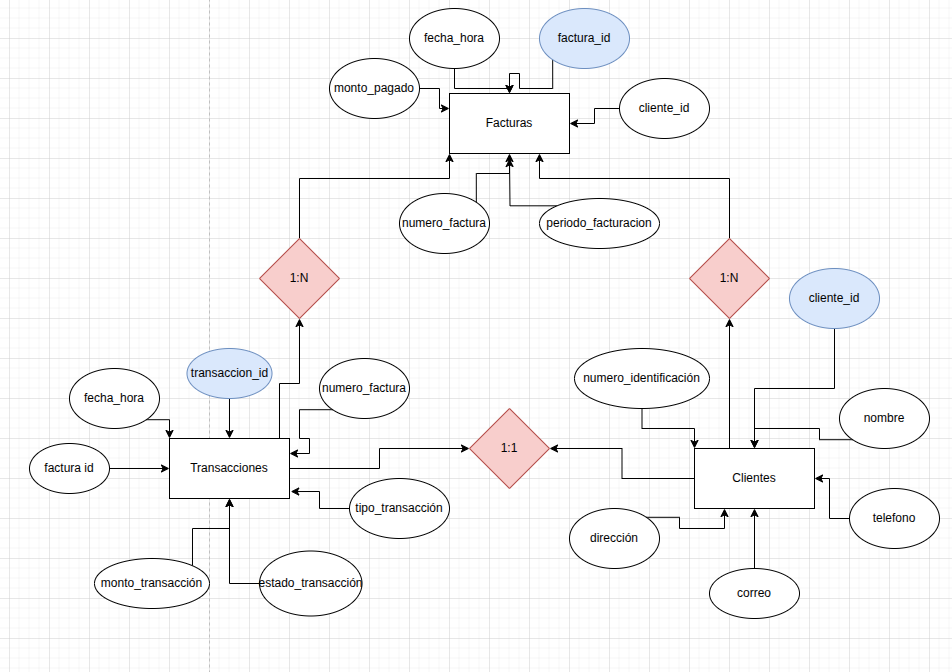

Project Title: PruebaSQL

Jeferson Escudero Rua 
Clan linus
ljeferr@gmail.com

1. System Description
This project contains a frontend and a backend for a SQL-related application.

The frontend folder includes user interface code.

The backend folder contains server or database-related code.
The system lets users interact with the database through a client interface and process data on the server side.
The masive data injection is allowable

2. How to Run the Project
Clone the repository:

Copiar
git clone https://github.com/ljeee/PruebaSQL.git
cd PruebaSQL

Backend:

Go to the Backend/ folder.

node server.js

And your backend is ready

Frontend:

Open index.html with live server

And enjoy 

You should see the application interface and be able to use the project.

3. Technologies Used
Frontend: JavaScript, HTML, CSS

Backend: Node.js, Express

4. Explanation of Normalization
Database normalization is the process of organizing data to reduce redundancy and improve integrity. This system uses a normalized relational model:

Data is separated into multiple tables based on different entities (for example, users, items, orders).

Each table has a primary key and foreign keys to create relationships.

The database design avoids duplicate data and supports efficient updates.

5. Instructions for Bulk Loading from CSV
To import data in bulk from a CSV file:

Prepare a .csv file with the correct column names and data format.

Use the SQL command (example for PostgreSQL):

Always check that the data matches the table schema and handle errors or duplicates.

Select the file you want to upload.

Click on the “Bulk upload CSV” button.

